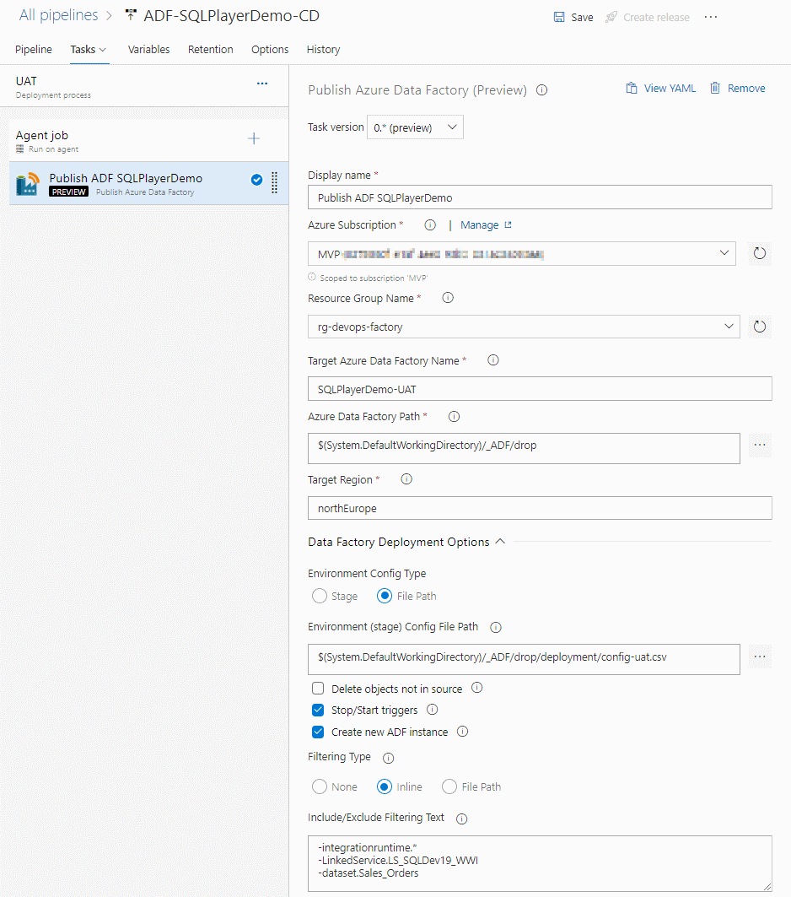

# Deploying Azure Data Factory instance

This extension to Azure DevOps has only one task and only one goal: deploy Azure Data Factory (v2) seamlessly at minimum efforts.
As opposed to ARM template publishing from 'adf_publish' branch, this task publishes ADF directly from JSON files, who represent all ADF artefacts.  
The task based on the PowerShell module [azure.datafactory.tools](https://github.com/SQLPlayer/azure.datafactory.tools) available through [PSGallery](https://www.powershellgallery.com/packages/azure.datafactory.tools/).  
Fully written in PowerShell, compatible with Windows PowerShell 5.1, PowerShell Core 6.0 and above.


# Azure DevOps Task

## How to add task
You will find the Task available under the Deploy tab, or search for **publish data factory**:


# Publish Azure Data Factory
Use this to deploy a folder of ADF objects from your repo to target Azure Data Factory instance.  


## Key capabilities

* Creation of Azure Data Factory, if not exist (option)
* Deployment of all type of objects: pipelines, datasets, linked services, data flows, triggers, integration runtimes
* Copes with dependencies (multiple levels) between objects when deploying (no more worrying about object names)
* Build-in mechanism to replace the properties with the indicated values (CSV file)
* Update, add or remove any property of ADF artefact
* Selective deployment declared in-line or by pointed file
* Stop/start triggers (option)
* Dropping objects when not exist in the source (code) (option)
* Filtering (include or exclude) objects to be deployed by name and/or type
* Publish options allow you to control:
  * Whether stop and restarting triggers
  * Whether delete or not objects not in the source
  * Whether create or not a new instance of ADF if it not exist

For more details, please go to [documentation of azure.datafactory.tools](https://github.com/SQLPlayer/azure.datafactory.tools/blob/master/README.md).


## Parameters
|Parameter label|Description|
|--|--|
| Azure Subscription | Azure subscription to target for deployment |
| Resource Group Name | Provide the name of the Resource Group |
| Target Azure Data Factory Name | Provide the name of the target Azure Data Factory|
| Azure Data Factory Path | Path from the repo root to the ADF folder which should contains sub-folders like 'pipeline', 'dataset', etc.|
| Target Region | Azure Region of target Data Factory. It is used only in order to create new instance of ADF|
| Environment Config Type | Specifies how you would provide set of parameters for Stage.  |
| Environment (stage) | Allows pointing configuration with values for all properties who need to be replaced. <br/> If parameter is specified, a CSV file named './deployment/config-{stage}.csv' must exists in repo.|
| Environment (stage) Config File Path | Allows pointing configuration with values for all properties who need to be replaced. <br/>If specified, CSV config file name must ends with '.csv'|
| Delete objects not in source | Indicates whether the deployment process should removing objects not existing in the source (code)|
| Stop/Start triggers | Indicates whether or not to stop the triggers before beginning deployment and start them afterwards|
| Create new ADF instance | Indicates whether or not to create a new ADF if target instance doesn't exist yet.|
| Filtering Type | Type of filtering ADF objects: File Path or Inline Text Field |
| Include/Exclude Filtering Text | Multi-line or comma-separated list of objects to be included or excluded in the deployment. <br/>For example, see below. |
| Include/Exclude Filtering File Path | Multi-line or comma-separated list of objects to be included/excluded in/from the deployment. <br/>For example, see below. | 


## Environment (stage) 

Optional parameter. When defined, process will replace all properties defined in (csv) configuration file.
The parameter can be either full path to csv file (must ends with .csv) or just stage name.
When you provide parameter value 'UAT' the process will try open config file located in `.\deployment\config-UAT.csv`

The whole concept of CI & CD (Continuous Integration and Continuous Delivery) process is to deploy automatically and riskless onto target infrastructure, supporting multi-environments. Each environment (or stage) to be exact the same code except selected properties. Very often these properties are:  
- Data Factory name
- Azure Key Vault URL (endpoint)
- Selected properties of Linked Services 
- Some variables
- etc.

All these values are hold among JSON files in code repository and due to their specifics - they are not parametrised as it happens in ARM template.
That is the reason of the need of replacing selected object's parameters into one specified for particular environment. The changes must be done just before deployment.

In order to address that needs, the process are able to read flat **configuration file** with all required values **per environment**. Below is the example of such config file:
```
type,name,path,value
linkedService,LS_AzureKeyVault,typeProperties.baseUrl,"https://kv-blog-uat.vault.azure.net/"
linkedService,LS_BlobSqlPlayer,typeProperties.connectionString,"DefaultEndpointsProtocol=https;AccountName=blobstorageuat;EndpointSuffix=core.windows.net;"
pipeline,PL_CopyMovies,activities[0].outputs[0].parameters.BlobContainer,UAT
pipeline,PL_CopyMovies_with_param,parameters.DstBlobContainer.defaultValue,UAT
pipeline,PL_Wait_Dynamic,parameters.WaitInSec,"{'type': 'int32','defaultValue': 22}"
# This is comment - the line will be omitted
```
> You can replace any property with that method.

There are 4 columns in CSV file:
- `type` - Type of object. It's the same as folder where the object's file located
- `name` - Name of objects. It's the same as json file in the folder
- `path` - Path of the property's value to be replaced within specific json file
- `value` - Value to be set

### Column TYPE

Column `type` accepts one of the following values only:
- integrationRuntime
- pipeline
- dataset
- dataflow
- linkedService
- trigger

### Column PATH

Unless otherwise stated, mechanism always **replace (update)** the value for property. Location for those Properties are specified by `Path` column in Config file.  
Additionally, you can **remove** selected property altogether or **create (add)** new one. To define desire action, put character `+` (plus) or `-` (minus) just before Property path:

* `+` (plus) - Add new property with defined value
* `-` (minus) - Remove existing property  

See example below:
```
type,name,path,value
# As usual - this line only update value for connectionString:
linkedService,BlobSampleData,typeProperties.connectionString,"DefaultEndpointsProtocol=https;AccountName=sqlplayer2019;EndpointSuffix=core.windows.net;"
# MINUS means the desired action is to REMOVE encryptedCredential:
linkedService,BlobSampleData,-typeProperties.encryptedCredential,
# PLUS means the desired action is to ADD new property with associated value:
linkedService,BlobSampleData,+typeProperties.accountKey,"$($Env:VARIABLE)"
```


### Column VALUE

You can define 3 types of values in column `Value`: number, string, (nested) JSON object.  
If you need to use comma (,) in `Value` column - remember to enclose entire value within double-quotes ("), like in this example below:
```
pipeline,PL_Wait_Dynamic,parameters.WaitInSec,"{'type': 'int32','defaultValue': 22}"
```

#### Using Tokens as dynamic values
You can use token syntax to define expression which should be replaced by value after reading CSV config file process. Currently PowerShell expression for environment is supported, which is: `$Env:VARIABLE` or `$($Env:VARIABLE)`.  
Assuming you have *Environment Variable* name `USERDOMAIN` with value `CONTOSO`, this line from config file:
```
linkedService,AKV,typeProperties.baseUrl,"https://$Env:USERDOMAIN.vault.azure.net/"
```
will become that one after reading from disk:
```
linkedService,AKV,typeProperties.baseUrl,"https://CONTOSO.vault.azure.net/"
```

Having that in mind, you can leverage variables defined in Azure DevOps pipeline to replace tokens without extra task. This is possible because all pipeline's variables are available as environment variables within the agent.


## Selective deployment
The task allows you to deploy subset of ADF's objects.   
You can select objects by objects types & name using include or exclude option.  
Type/Name can be wildcarded, so all such variants are possible:

You can specify them by exact name or wildcard. 
  Example:  
  ```
  +pipeline.PL_Copy*  
  +dataset.ds_srcCopy  
  dataset.*  
  -pipeline.PL_DoNotPublish*  
  -integrationruntime.*
  ```
To simplify user experience – only one field is exposed in order to define include/exclude rules.
Therefore, an extra character should be provided before the name/pattern:
* `+` (plus) - for objects you want to include to a deployment
* `-` (minus) - for objects you want to exclude from a deployment  

If char (+/-) is not provided – an inclusion rule would be applied.


# Screenshot of the Task 


# Related modules
This task includes the following modules:  
- [azure.datafactory.tools - ver.0.14.0](https://www.powershellgallery.com/packages/azure.datafactory.tools/0.14.0)
- [Az.DataFactory - ver.1.9.0](https://www.powershellgallery.com/packages/Az.DataFactory/1.9.0)
- [Az.Accounts - ver.1.9.2](https://www.powershellgallery.com/packages/Az.Accounts/1.9.2)
- [Az.Resources - ver.2.4.0](https://www.powershellgallery.com/packages/Az.Resources/2.4.0)

# History
- 09 Aug 2020 - v.0.6   Added Environment Variables mapping (Advanced) & Publish Method to be chosen
- 04 Aug 2020 - v.0.5   Fix bug #3: Add module Az.Resources + upgrade other Az.*
- 26 Jul 2020 - v.0.4   Upgrade all related modules (new features)
- 06 Jun 2020 - v.0.3   Upgrade module azure.datafactory.tools to ver.0.10 (a few bug fixes)
- 27 May 2020 - v.0.2   Enhanced few things. First Public Preview release.
- 15 May 2020 - v.0.1   The first Private Preview release. 
