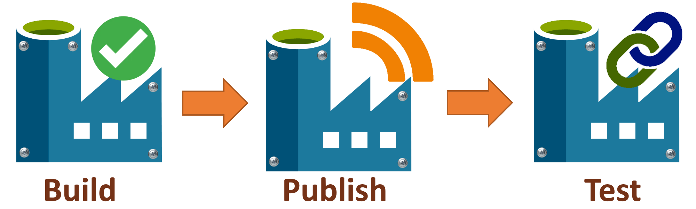
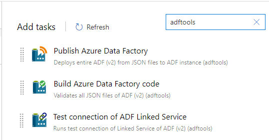
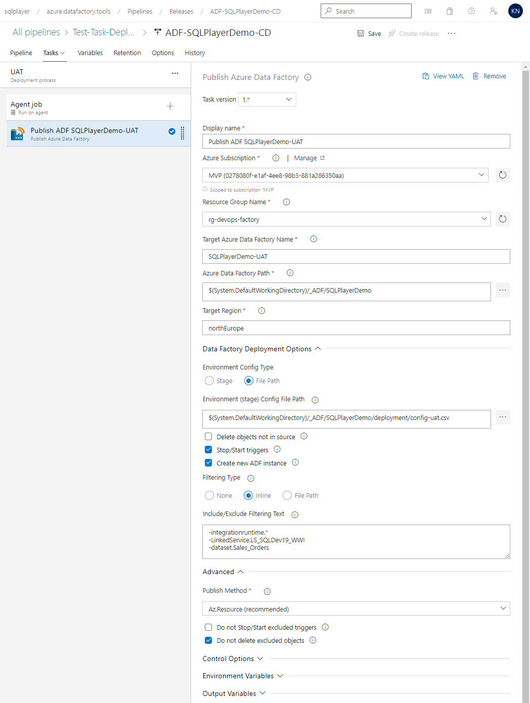
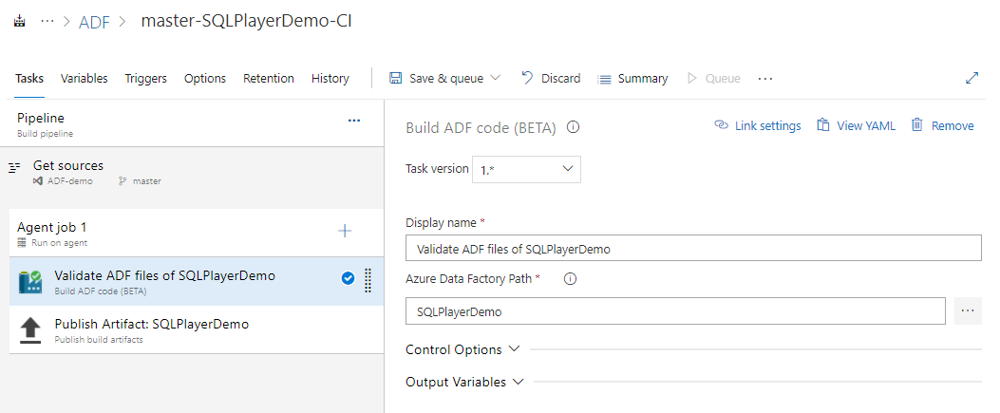
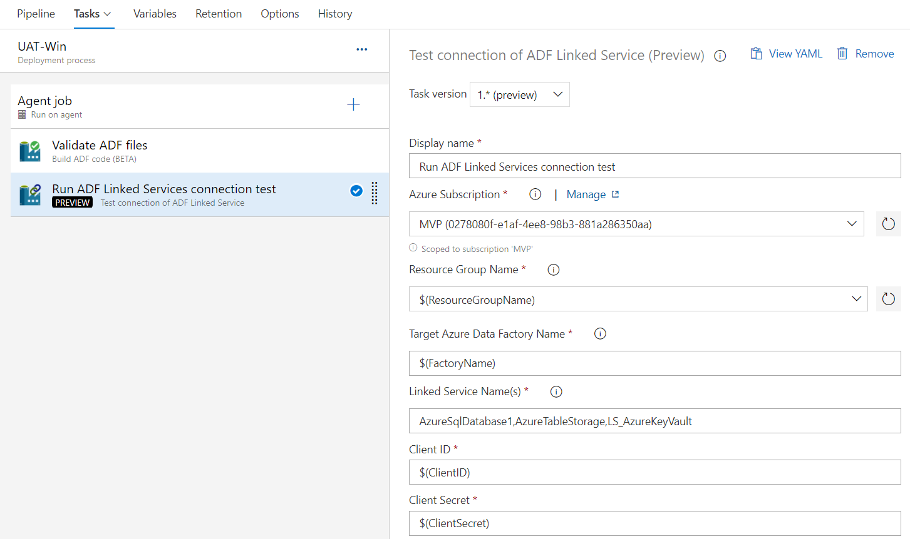

# Azure DevOps Tasks (#adftools)



This extension to Azure DevOps has three tasks and only one goal: deploy Azure Data Factory (v2) seamlessly and reliable at minimum efforts.
As opposed to ARM template publishing from 'adf_publish' branch, this task publishes ADF directly from JSON files, who represent all ADF artefacts.  
The task based on the PowerShell module [azure.datafactory.tools](https://github.com/SQLPlayer/azure.datafactory.tools) available through [PSGallery](https://www.powershellgallery.com/packages/azure.datafactory.tools/).  
Fully written in PowerShell, compatible with Windows PowerShell 5.1, PowerShell Core 6.0 and above.

## Three tasks
- [**Build Azure Data Factory code**](#buildtest-azure-data-factory-code) - Validates all JSON files of ADF (v2) (adftools)
- [**Publish Azure Data Factory**](#publish-azure-data-factory) - Deploys entire ADF (v2) from JSON files to ADF instance
- [**Test connection of ADF Linked Service** (*preview*)](#test-connection-of-adf-linked-service) - Runs test connection of Linked Service of ADF (v2)

> Bear in mind that these tasks works only for Azure Data Factory **v2**.

## How to add task
For classic pipelines, you will find the Tasks available under the Deploy tab, or search for **adftools**:


You can also use the tasks in a pipeline configured with a yml file, the three tasks are called `SQLPlayer.DataFactoryTools.BuildADF.BuildADFTask`, `SQLPlayer.DataFactoryTools.PublishADF.PublishADFTask` and `SQLPlayer.DataFactoryTools.TestADFLS.TestAdfLinkedServiceTask`.
You can also use the DevOps UI to configure these tasks and then view the generated yml, to ensure the yml is correct.
One example, in which we use the 'Build ADF' task:

```yaml
- job: 'build_adf'
  displayName: 'Build Azure Data Factory'
  pool:
    vmImage: 'windows-latest'
  steps:
    - task: SQLPlayer.DataFactoryTools.BuildADF.BuildADFTask@1
      displayName: 'Validate ADF files'
      inputs:
        DataFactoryCodePath: '$(System.DefaultWorkingDirectory)/data-factory'
        Action: Build
```

# Publish Azure Data Factory


Use this task to deploy a folder of ADF objects from your repo to target Azure Data Factory instance.  
For [YAML pipelines](https://docs.microsoft.com/en-us/azure/devops/pipelines/get-started/pipelines-get-started), use task `PublishADFTask@1`.


## Key capabilities

* Creation of Azure Data Factory, if not exist (option)
* Deployment of all type of objects: pipelines, datasets, linked services, data flows, triggers, integration runtimes
* Copes with dependencies (multiple levels) between objects when deploying (no more worrying about object names)
* Build-in mechanism to replace the properties with the indicated values (CSV file)
* Update, add or remove any property of ADF artefact
* Selective deployment declared in-line or by pointed file
* Stop/start triggers (option)
* Dropping objects when not exist in the source (code) (option)
* Filtering (include or exclude) objects to be deployed by name and/or type and/or type
* Filtering supports wildcards
* Publish options allow you to control:
  * Whether stop and restarting triggers
  * Whether delete or not objects not in the source
  * Whether create or not a new instance of ADF if it not exist
* Tokenisation in config file allows replace any value by Environment Variable or Variable from DevOps Pipeline
* Global Parameters
* Export ARM Templates from JSON files (new!)
* Support for Managed VNET and Managed Private Endpoint (new!)
* Build function to support validation of files, dependencies and config
* Test connections (Linked Services)

For more details, please go to [documentation of azure.datafactory.tools](https://github.com/SQLPlayer/azure.datafactory.tools/blob/master/README.md).


## Parameters
|Parameter label|Parameter name (for YAML task)|Description|
|--|--|--|
| Azure Subscription | `azureSubscription` | Azure subscription to target for deployment |
| Resource Group Name | `ResourceGroupName` | Provide the name of the Resource Group |
| Target Azure Data Factory Name | `DataFactoryName` | Provide the name of the target Azure Data Factory|
| Azure Data Factory Path | `DataFactoryCodePath` | Path from the repo root to the ADF folder which should contains sub-folders like 'pipeline', 'dataset', etc.|
| Target Region | `Location` | Azure Region of target Data Factory. Required, but used only when creating a new instance of ADF|
| Environment Config Type | `StageType` | Specifies how you would provide set of parameters for Stage.  |
| Environment (stage) | `StageCode` | Allows pointing configuration with values for all properties who need to be replaced. <br/> If parameter is specified, a CSV file named './deployment/config-{stage}.csv' must exist in repo.|
| Environment (stage) Config File Path | `StageConfigFile` | Allows pointing configuration with values for all properties who need to be replaced. <br/>If specified, CSV config file name must ends with '.csv'|
| Delete objects not in source | `DeleteNotInSource` | Indicates whether the deployment process should remove objects not existing in the source (code)|
| Stop/Start triggers | `StopStartTriggers` | Indicates whether to stop the triggers before beginning deployment and start them afterwards|
| Create new ADF instance | `CreateNewInstance` | Indicates whether to create a new ADF if target instance doesn't exist yet.|
| Filtering Type | `FilteringType` | Type of filtering ADF objects: File Path or Inline Text Field |
| Include/Exclude Filtering Text | `FilterText` | Multi-line or comma-separated list of objects to be included or excluded in the deployment. <br/>For example, see below. |
| Include/Exclude Filtering File Path | `FilterTextFile` | Multi-line or comma-separated list of objects to be included/excluded in/from the deployment. <br/>For example, see below. | 
| Do not Stop/Start excluded triggers | `DoNotStopStartExcludedTriggers` | Specifies whether excluded triggers will be stopped before deployment. |
| Do not delete excluded objects | `DoNotDeleteExcludedObjects` | Specifies whether excluded objects can be removed. Applies when `DeleteNotInSource` is set to *True* only. |


## Environment (stage) 

Optional parameter. When defined, process will replace all properties defined in (csv) configuration file.
The parameter can be either full path to csv file (must ends with .csv) or just stage name.
When you provide parameter value 'UAT' the process will try open config file located in `.\deployment\config-UAT.csv`

The whole concept of CI & CD (Continuous Integration and Continuous Delivery) process is to deploy automatically and riskless onto target infrastructure, supporting multi-environments. Each environment (or stage) to be exact the same code except selected properties. Very often these properties are:  
- Data Factory name
- Azure Key Vault URL (endpoint)
- Selected properties of Linked Services 
- Some variables
- etc.

All these values are hold among JSON files in code repository and due to their specifics - they are not parametrised as it happens in ARM template.
That is the reason of the need of replacing selected object's parameters into one specified for particular environment. The changes must be done just before deployment.

In order to address that needs, the process are able to read flat **configuration file** with all required values **per environment**. Below is the example of such config file:
```
type,name,path,value
linkedService,LS_AzureKeyVault,typeProperties.baseUrl,"https://kv-blog-uat.vault.azure.net/"
linkedService,LS_BlobSqlPlayer,typeProperties.connectionString,"DefaultEndpointsProtocol=https;AccountName=blobstorageuat;EndpointSuffix=core.windows.net;"
pipeline,PL_CopyMovies,activities[0].outputs[0].parameters.BlobContainer,UAT
pipeline,PL_CopyMovies_with_param,parameters.DstBlobContainer.defaultValue,UAT
pipeline,PL_Wait_Dynamic,parameters.WaitInSec,"{'type': 'int32','defaultValue': 22}"
# This is comment - the line will be omitted
```
> You can replace any property with that method.

There are 4 columns in CSV file:
- `type` - Type of object. It's the same as folder where the object's file located
- `name` - Name of objects. It's the same as json file in the folder
- `path` - Path of the property's value to be replaced within specific json file
- `value` - Value to be set

### Column TYPE

Column `type` accepts one of the following values only:
- integrationRuntime
- pipeline
- dataset
- dataflow
- linkedService
- trigger
- factory *(for Global Parameters)*

### Column NAME

This column defines an object. Since the latest version, you can speficy the **name** using wildcards. That means rather than duplicating lines for the same configuration (path&value) for multiple files, you can define only one line in config.

### Column PATH

Unless otherwise stated, mechanism always **replace (update)** the value for property. Location for those Properties are specified by `Path` column in Config file.  
Additionally, you can **remove** selected property altogether or **create (add)** new one. To define desire action, put character `+` (plus) or `-` (minus) just before Property path:

* `+` (plus) - Add new property with defined value
* `-` (minus) - Remove existing property  

See example below:
```
type,name,path,value
# As usual - this line only update value for connectionString:
linkedService,BlobSampleData,typeProperties.connectionString,"DefaultEndpointsProtocol=https;AccountName=sqlplayer2019;EndpointSuffix=core.windows.net;"
# MINUS means the desired action is to REMOVE encryptedCredential:
linkedService,BlobSampleData,-typeProperties.encryptedCredential,
# PLUS means the desired action is to ADD new property with associated value:
linkedService,BlobSampleData,+typeProperties.accountKey,"$($Env:VARIABLE)"
factory,BigFactorySample2,"$.properties.globalParameters.'Env-Code'.value","PROD"
# Multiple following configurations for many files:
dataset,DS_SQL_*,properties.xyz,ABC
```


### Column VALUE

You can define 3 types of values in column `Value`: number, string, (nested) JSON object.  
If you need to use comma (,) in `Value` column - remember to enclose entire value within double-quotes ("), like in this example below:
```
pipeline,PL_Wait_Dynamic,parameters.WaitInSec,"{'type': 'int32','defaultValue': 22}"
```

#### Using Tokens as dynamic values
You can use token syntax to define expression which should be replaced by value after reading CSV config file process. Currently PowerShell expression for environment is supported, which is: `$Env:VARIABLE` or `$($Env:VARIABLE)`.  
Assuming you have *Environment Variable* name `USERDOMAIN` with value `CONTOSO`, this line from config file:
```
linkedService,AKV,typeProperties.baseUrl,"https://$Env:USERDOMAIN.vault.azure.net/"
```
will become that one after reading from disk:
```
linkedService,AKV,typeProperties.baseUrl,"https://CONTOSO.vault.azure.net/"
```

Having that in mind, you can leverage variables defined in Azure DevOps pipeline to replace tokens without extra task. This is possible because all pipeline's variables are available as environment variables within the agent.


## Selective deployment
The task allows you to deploy subset of ADF's objects.   
You can select objects specifying them by object's type, name or folder which belongs to, using include or exclude option.  
All 3 parts (Type, Name, Folder) can be wildcarded, so all such variants are possible:

You can specify them by exact name or wildcard. 
  Example:  
  ```
  +pipeline.PL_Copy*  
  +dataset.ds_srcCopy  
  dataset.*  
  -pipeline.PL_DoNotPublish*  
  -integrationruntime.*
  -*.*@testFolder
  ```
To simplify user experience – only one field is exposed in order to define include/exclude rules.
Therefore, an extra character should be provided before the name/pattern:
* `+` (plus) - for objects you want to include to a deployment
* `-` (minus) - for objects you want to exclude from a deployment  

If char (+/-) is not provided – an inclusion rule would be applied.


### Screenshot of Publish Task 



# Build/Test Azure Data Factory code


Another very helpful task is `Build Azure Data Factory`. 
The task has two actions to be chosen:

## Build only
Use this action to validate the code of your Azure Data Factory before you publish it onto target ADF service. 
The function validates files of ADF in a given location, returning warnings or errors. 
This validation functionality is implemented in this task, so it is not the same implementation as behind the 'Validate all' button in the ADF UI.
The following validation will be performed:
- Reads all files and validates its json format
- Checks whether all dependant objects exist
- Checks whether file name equals object name
- Validate configuration file(s) and its paths

The task sets these 2 pipeline output variables:
- AdfBuildTaskErrors
- AdfBuildTaskWarnings
These variables will contain the number of errors or warnings found.

You can use them in any subsequent tasks as any other DevOps variables: `$(AdfBuildTaskErrors)`

## Validate & Export ARM Template
This action uses [**ADFUtilities** NPM package](https://www.npmjs.com/package/@microsoft/azure-data-factory-utilities) provided by Microsoft. 
It does exactly the same actions as you can do with ADF UI by clicking **Validate all** and then **Export ARM Template**.
Therefore, this is a different implementation as the other action described above.
So finally, you can automate this step and fully automate ADF deployment, even if you prefer to use [Microsoft's approach](https://docs.microsoft.com/en-us/azure/data-factory/continuous-integration-deployment-improvements) with ARM Template.

### Parameters:  
- `DataFactoryCodePath` - Source folder where all ADF objects are kept. The folder should contain subfolders like pipeline, linkedservice, etc.
- `Action` - One of two actions to be executed:
  - `Build only (simple validate)` (`Build` for in YAML task) - Validates files integrity. No outcome files.
  - `Validate & Export ARM Template` (`Export` for in YAML task) - Validates files and export ARM Template files like ADF UI does. ARM Template files as the result. It uses ADFUtilities NPM package provided by Microsoft.

### Screenshot of Build Task 



# Test connection of ADF Linked Service


After deployment within automated CI/CD process, we would like to test foundamental Linked Services whom are used for dependant objects in ADF. In order to ensure the entire workload works, we must make sure that all Linked Services are configured correctly and have access to pointing resources.  
The purpose of this task is to ensure such checking. It works exactly the same as hitting button `Check connection` in ADF Linked Service.

> Be aware that the task uses undocumented API function.

*Credits*: This task arose thanks to Simon D'Morias based on his [blog post](https://datathirst.net/blog/2018/9/23/adfv2-testing-linked-services).


### Screenshot of Test Connection Task 



# Related modules
These tasks include the following modules:  
- [azure.datafactory.tools - ver.0.95.0](https://www.powershellgallery.com/packages/azure.datafactory.tools/0.95.0)
- [Az.DataFactory - ver.1.14.0](https://www.powershellgallery.com/packages/Az.DataFactory/1.14.0)
- [Az.Accounts - ver.2.5.3](https://www.powershellgallery.com/packages/Az.Accounts/2.5.3)
- [Az.Resources - ver.4.3.1](https://www.powershellgallery.com/packages/Az.Resources/4.3.1)

# History
- 07 Dec 2021 - v.1.11  Updated to ver.0.95 in order to fix a few issues.
- 24 Oct 2021 - v.1.10  Added: Build task sets 2 pipeline output variables: AdfBuildTaskErrors & AdfBuildTaskWarnings
- 01 Oct 2021 - v.1.9   Fixed [#147](https://github.com/SQLPlayer/azure.datafactory.tools/issues/147): Pipeline could be broken when contains array with 1 item in JSON file and any property was updated  
- 29 Sep 2021 - v.1.8   Added ADF config path to build task  
- 28 Sep 2021 - v.1.7   Updated main module to ver. 0.91 with the following features:  
                        - Added retry action on failure of starting triggers  
                        - Build task validates config files  
                        - Support for ADF Managed Virtual Network & Managed Private Endpoint (preview), including its configuration  
                        - Config: Added option to index into arrays by element name  
                        - Removing excluded ADF objects when option $DoNotDeleteExcludedObjects = $false  
                        - Changed method of discovering referenced objects (Get-ReferencedObjects)  
                        - Fixed minor issues ([all details](https://github.com/SQLPlayer/azure.datafactory.tools/blob/master/changelog.md))
- 21 Apr 2021 - v.1.6   Build task fails when any error is found ([#36](https://github.com/SQLPlayer/azure.datafactory.devops/issues/36))
- 14 Mar 2021 - v.1.5   Build task can validate and export ARM Template from source code (JSON files)
- 10 Feb 2021 - v.1.4   Added new task: TestAdfLinkedServiceTask (preview)
- 20 Jan 2021 - v.1.2   Fixed: JSON file corrupted when contained object is located deeper than 15 nodes  
- 14 Jan 2021 - v.1.1   New task: Build/Test Azure Data Factory Code  
- 10 Jan 2021 - v.1.0   New publish flag: `DoNotDeleteExcludedObjects`  
                        New publish flag: `DoNotStopStartExcludedTriggers`
- 23 Dec 2020 - v.0.90  PUBLIC Release:  
                        Support wildcard when specifying object(s) name in config file  
                        Added object name to the msg before action  
                        Exit publish cmd when ADF name is already in use  
                        Allow selecting objects in given folder (#14)  
                        Fixed: Finding dependencies miss objects when the same object names occurs  
                        Fixed: DeleteNotInSource fails when attempting to remove active trigger or found many dependant objects
- 08 Dec 2020 - v.0.11  Fixed: JSON file could be corrupted when config update has happened on a very deep path
                        Fixed: Special characters deployed wrong
- 06 Dec 2020 - v.0.10  Fixed: File Path Filtering Type not working
- 19 Nov 2020 - v.0.9   Fixed check which hasn't allowed passing config file in json format
- 10 Sep 2020 - v.0.8   Fixed issue with deployment when no global parameters
- 09 Sep 2020 - v.0.7   Support of Global Parameters
- 09 Aug 2020 - v.0.6   Added Environment Variables mapping (Advanced) & Publish Method to be chosen
- 04 Aug 2020 - v.0.5   Fix bug #3: Add module Az.Resources + upgrade other Az.*
- 26 Jul 2020 - v.0.4   Upgrade all related modules (new features)
- 06 Jun 2020 - v.0.3   Upgrade module azure.datafactory.tools to ver.0.10 (a few bug fixes)
- 27 May 2020 - v.0.2   Enhanced few things. First Public Preview release.
- 15 May 2020 - v.0.1   The first Private Preview release. 
